# Leave Management — Design Documentation

This document describes **what** the system does and **how** it is built. It contains the agile backlog, use case diagram, process flows, state diagrams, sequence diagrams, ER diagram and data dictionary.

The diagrams are written in [Mermaid](https://mermaid.js.org/). They render on GitHub, in the VS Code Markdown preview (with the *Markdown Preview Mermaid Support* extension), and at https://mermaid.live. See [section 9](#9-viewing-and-exporting-the-diagrams) for how to export them as images.

**Contents**
1. [Overview](#1-overview)
2. [Agile process](#2-agile-process)
3. [Use case diagram](#3-use-case-diagram)
4. [Use case descriptions](#4-use-case-descriptions)
5. [Process flow](#5-process-flow)
6. [State diagrams](#6-state-diagrams)
7. [Sequence diagrams](#7-sequence-diagrams)
8. [ER diagram and data dictionary](#8-er-diagram-and-data-dictionary)
9. [Viewing and exporting the diagrams](#9-viewing-and-exporting-the-diagrams)

---

## 1. Overview

### 1.1 Goal
Let employees apply for leave. The system checks each request against the company leave policy and routes it to the employee's manager, who approves or rejects it. Everyone involved is notified.

### 1.2 Actors

| Actor | Who | Main goals |
|---|---|---|
| **Employee** | Any staff member (role `EMPLOYEE`) | Apply for leave, check balance, cancel leave, read notifications |
| **Manager** | Staff with direct reports (role `MANAGER`) | Everything an employee can do, plus view the team's leave and approve or reject requests |
| **HR** | HR staff (role `HR`) | Everything an employee can do, plus manage employees, leave policies and holidays, and view all leave |
| **System** | The application itself | Check requests against policy, count working days, create approval tasks, send notifications |

### 1.3 Architecture

One Spring Boot application, split into modules (Java packages). Modules call each other's services directly, or publish **events** so that they don't depend on each other.

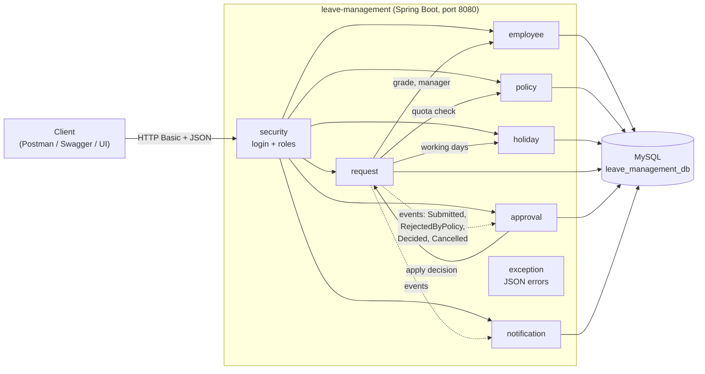

### 1.4 Layers inside each module

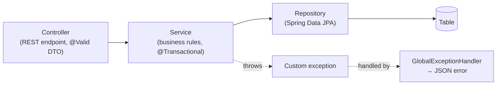

| Layer | Example | Responsibility |
|---|---|---|
| Controller | `LeaveRequestController` | URL mapping, input validation, HTTP status |
| DTO | `ApplyLeaveRequest`, `LeaveBalanceResponse` | Shape of the request and response JSON |
| Service | `LeaveRequestService` | Business rules, transactions, access checks |
| Repository | `LeaveRequestRepository` | Database queries |
| Entity | `LeaveRequest` | Mapping to a table row |
| Migration | `V1__create_schema.sql` | Table structure (Flyway) |

---

## 2. Agile process

### 2.1 How the work is organised

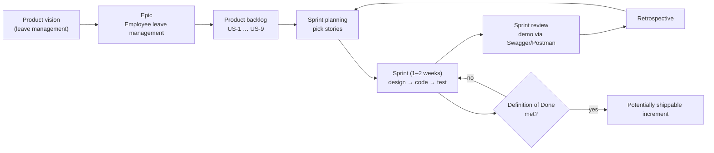

**Definition of Ready** (before a story enters a sprint):
- It has a user story statement and acceptance criteria.
- Its API endpoint and data changes are identified.
- It has no open questions.

**Definition of Done** (before a story is closed):
- The code compiles and `mvnw test` passes (unit and API tests for the story).
- Error cases return the documented HTTP codes and JSON errors.
- The endpoint appears in Swagger and in the Postman collection.
- A Flyway migration exists for any table change.
- README and this document are updated.

### 2.2 Product backlog

Priority: **M** = must have, **S** = should have. Story points are relative effort.

| ID | User story | Priority | Points | Sprint |
|---|---|---|---|---|
| US-1 | As **HR**, I want to manage employees (grade, role, manager) so that leave can be checked and routed. | M | 5 | 1 |
| US-2 | As **HR**, I want leave policies per grade and leave type so that quotas are enforced. | M | 3 | 1 |
| US-3 | As **HR**, I want to maintain company holidays so that only working days are counted. | S | 3 | 2 |
| US-4 | As an **employee**, I want to apply for leave so that my manager can approve it. | M | 8 | 2 |
| US-5 | As a **manager**, I want to approve or reject my team's requests so that leave is controlled. | M | 5 | 2 |
| US-6 | As an **employee/manager**, I want to see balance and summary, and to cancel leave, so that I can plan. | M | 5 | 3 |
| US-7 | As the **company**, I want login and roles so that people only do what they are allowed to. | M | 8 | 3 |
| US-8 | As a **user**, I want notifications so that I know when something needs my attention. | S | 3 | 3 |
| US-9 | As an **API user**, I want clear errors, paging, API docs and a health check. | S | 3 | 3 |

### 2.3 Sprint plan

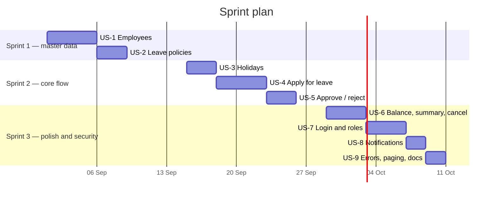

### 2.4 Acceptance criteria (Given / When / Then)

**US-1 Manage employees**
- *Given* I am HR, *when* I create an employee with a valid name, email, password (8–72 characters), grade (L1–L3) and role, *then* I get **201** and the password is not returned.
- *Given* the email already exists (any letter case), *when* I create the employee, *then* I get **409**.
- *Given* the manager does not exist, is deactivated, or has role `EMPLOYEE`, *then* I get **400**.
- *Given* the new manager reports (directly or indirectly) to the employee, *when* I update the employee, *then* I get **400** (reporting loop).
- *Given* an employee still manages active people or has pending approvals, *when* I deactivate them, *then* I get **409**.
- *Given* an employee is deactivated, *when* they try to log in, *then* they get **401**.

**US-2 Leave policies**
- *Given* the app starts on an empty database, *then* 9 default policies exist (L1–L3 × CASUAL/SICK/EARNED).
- *Given* a policy already exists for a grade and type, *when* HR creates another, *then* the response is **409**.
- *When* anyone calls `/evaluate`, *then* the response says whether the requested days fit into quota + carried − used.

**US-3 Holidays**
- *Given* a holiday falls on a weekday inside a request, *then* that day is not counted.
- *Given* a request covers only weekends or holidays, *then* the response is **400**.

**US-4 Apply for leave**
- *Given* the request fits the remaining quota, *then* its status is `PENDING`, an approval task is created for my manager, and both of us are notified.
- *Given* it does not fit, *then* its status is `REJECTED_BY_POLICY` with the reason, and I am notified.
- *Given* I already have pending or approved leave on any of those dates, *then* the response is **409**.
- *Given* the end date is before the start date, the request spans two years, it spans more than 60 days, or I have no manager, *then* the response is **400**.
- Pending days count as used, so two pending requests together cannot exceed the quota.

**US-5 Approve or reject**
- *Given* I am the assigned approver and the task is `PENDING`, *when* I decide `APPROVED` or `REJECTED`, *then* the task and the leave request are both updated, and the employee is notified.
- *Given* I am not the assigned approver, *then* the response is **403**. *Given* the task was already decided, *then* the response is **409**.

**US-6 Balance, summary, cancel**
- The balance shows, per leave type: quota, carried forward, used, pending and remaining.
- I can cancel my `PENDING` leave, or `APPROVED` leave that has not started. The approval task becomes `CANCELLED`, the days are released, and my manager is notified.
- The summary shows the counts of rejected and still-pending requests for a year.

**US-7 Login and roles:** unauthenticated calls get **401**. A role that is not allowed, or another person's record, gets **403**.

**US-8 Notifications:** I only see my own notifications. I can mark one or all as read.

**US-9 API quality:** every error has `timestamp, status, error, message`. Lists are paged (maximum 100 per page). `/swagger-ui.html` and `/actuator/health` are public.

---

## 3. Use case diagram

`Manager` and `HR` **inherit** every use case of `Employee` (dashed arrows).

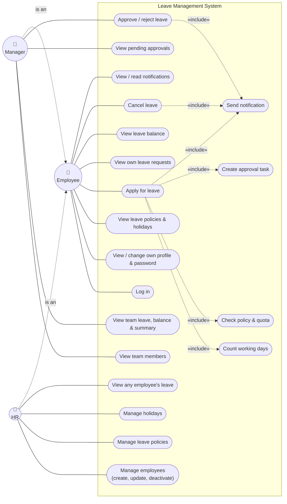

> A standard UML version of this diagram (stick figures, ovals, system boundary) is in [`diagrams/use-case.puml`](diagrams/use-case.puml). See section 9 for how to render it.

---

## 4. Use case descriptions

### UC04 — Apply for leave
| | |
|---|---|
| **Actor** | Employee (also Manager, HR) |
| **Precondition** | Logged in; has a manager; a policy exists for their grade and leave type |
| **Trigger** | `POST /api/leave-requests` |
| **Postcondition** | Leave request saved as `PENDING` (with an approval task) or as `REJECTED_BY_POLICY` |

**Main flow**
1. The employee sends the leave type, start date, end date and reason.
2. The system validates the fields (type is CASUAL/SICK/EARNED; dates are present and in `yyyy-MM-dd` format).
3. The system checks the dates: end is not before start, both are in the same year, and the span is at most 60 days.
4. The system locks the employee record, so parallel requests are handled one at a time.
5. The system checks that the employee has a manager and no overlapping pending or approved leave.
6. The system counts working days, excluding weekends and holidays.
7. The system reads the policy and calculates used + pending days and carry-forward.
8. The request fits the remaining quota, so the status is `PENDING`.
9. The system saves the request, creates an approval task for the manager, and notifies the manager and the employee.
10. The system returns **201** with the request.

**Alternative flows**
- **2a** Invalid field → **400** with `fieldErrors`.
- **3a** Bad dates → **400**.
- **5a** No manager → **400**. Overlapping leave → **409**.
- **6a** 0 working days → **400**.
- **7a** No policy for the grade and type → **400**.
- **8a** Over quota → status `REJECTED_BY_POLICY`, reason stored in `policyRemarks`, employee notified, **201**.

### UC13 — Approve / reject leave
| | |
|---|---|
| **Actor** | Manager (the assigned approver) |
| **Precondition** | An approval task for this manager is `PENDING` |
| **Trigger** | `PUT /api/approvals/{id}/decide?decision=APPROVED\|REJECTED&comments=` |
| **Postcondition** | Task and leave request both show the decision; employee notified |

**Main flow**
1. The manager lists pending tasks (`GET /api/approvals/pending`).
2. The manager sends a decision for one task.
3. The system validates the decision and the comments (at most 255 characters).
4. The system locks the task and checks that the caller is its approver and that the task is still `PENDING`.
5. The system updates the leave request to `APPROVED` or `REJECTED`.
6. The system updates the task (status, comments, decision time) and notifies the employee.
7. The system returns **200** with the task.

**Alternative flows**
- **3a** Invalid decision or comments → **400**.
- **4a** Unknown task → **404**. Not the approver → **403**. Already decided or cancelled → **409**.

### UC07 — Cancel leave
| | |
|---|---|
| **Actor** | Employee who applied, or HR |
| **Trigger** | `PUT /api/leave-requests/{id}/cancel` |

**Main flow**
1. The system loads the request and checks that the caller is its owner or HR (otherwise **403**).
2. The request is `PENDING`, or `APPROVED` with a start date in the future.
3. The status becomes `CANCELLED`. A pending approval task becomes `CANCELLED`, and the manager is notified.
4. The system returns **200**.

**Alternative flows**
- **2a** Approved leave that has already started, or a request that is already rejected or cancelled → **409**.

### UC20 — Manage employees (HR)
- **Create** (`POST /api/employees`): validates the fields, checks that the email is unique, and checks the manager rules. The password is stored as a BCrypt hash.
- **Update** (`PUT /api/employees/{id}`): changes name, grade, role and manager. It blocks reporting loops, demoting a manager who still has reports, and demoting the last HR user.
- **Deactivate** (`DELETE /api/employees/{id}`): a soft delete. It is blocked for yourself, for someone who still has reports or pending approvals, and for the last HR user.

---

## 5. Process flow

### 5.1 End-to-end leave flow

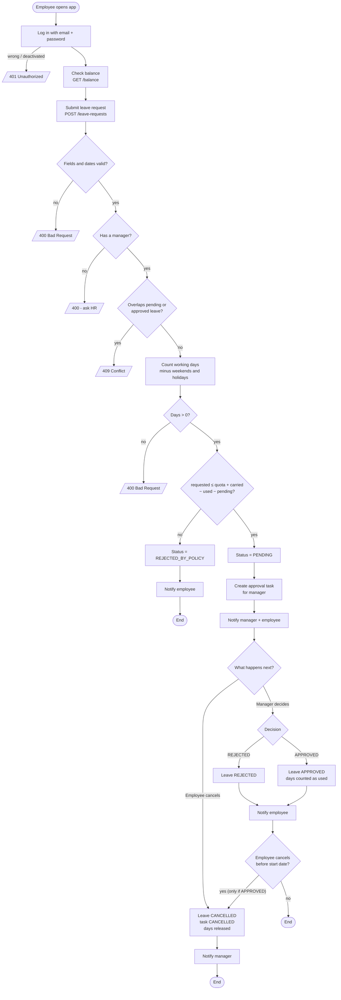

### 5.2 Leave quota calculation

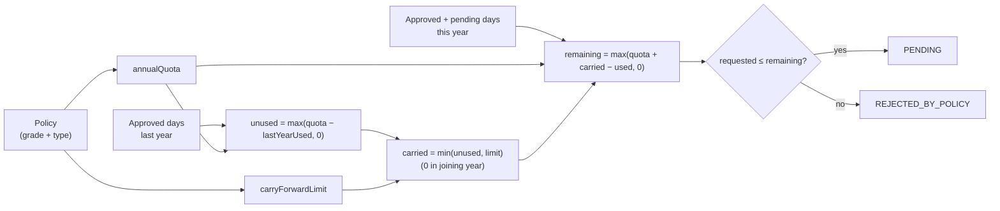

### 5.3 Request handling (every API call)

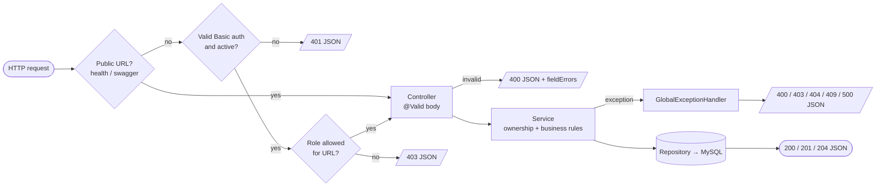

---

## 6. State diagrams

### 6.1 Leave request status

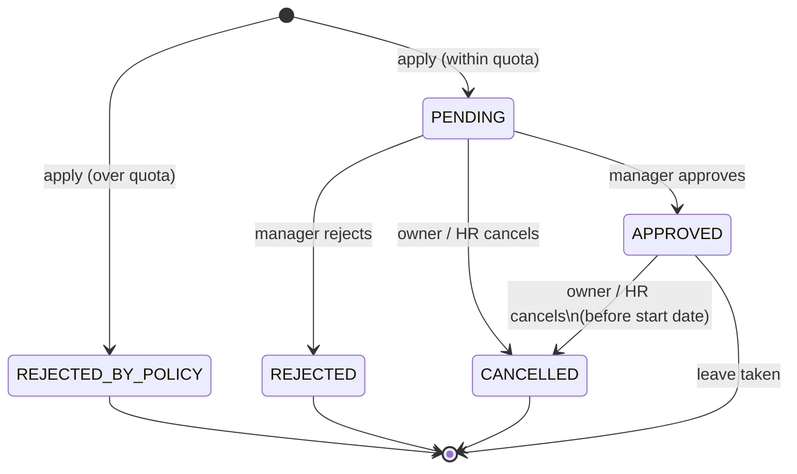

### 6.2 Approval task status

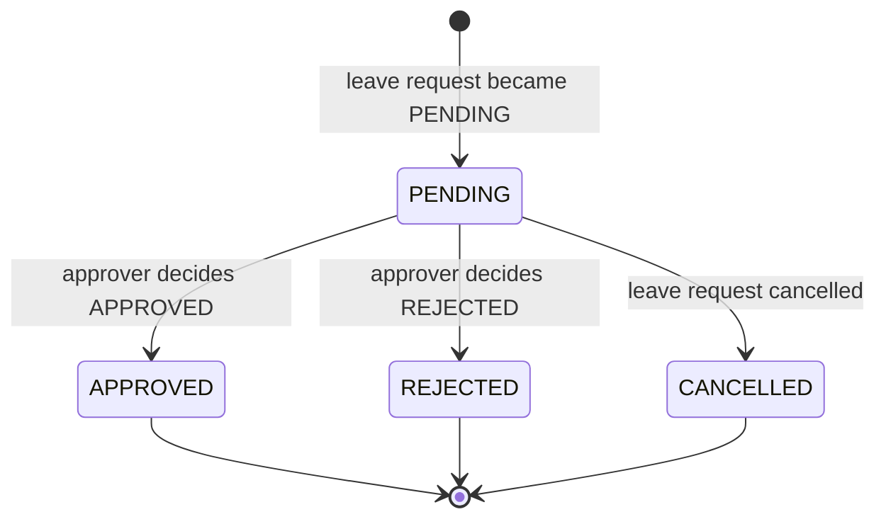

### 6.3 Employee account

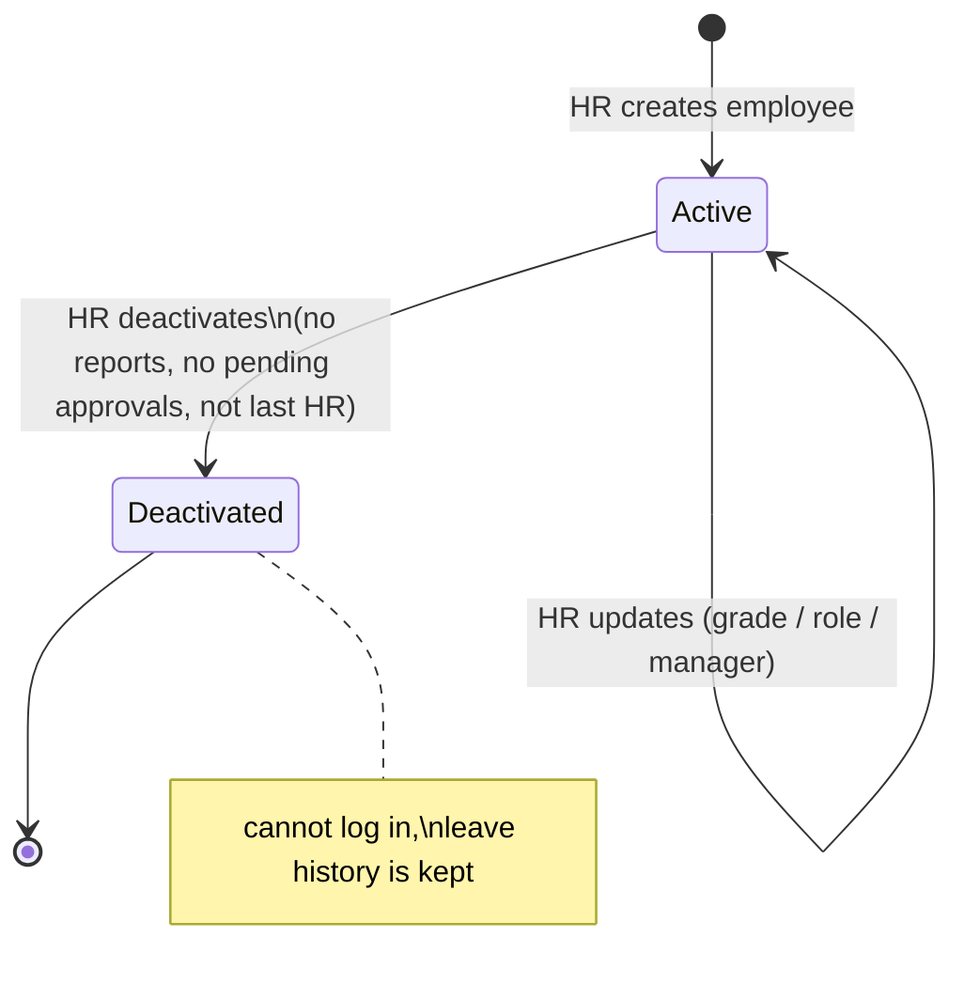

---

## 7. Sequence diagrams

### 7.1 Apply for leave

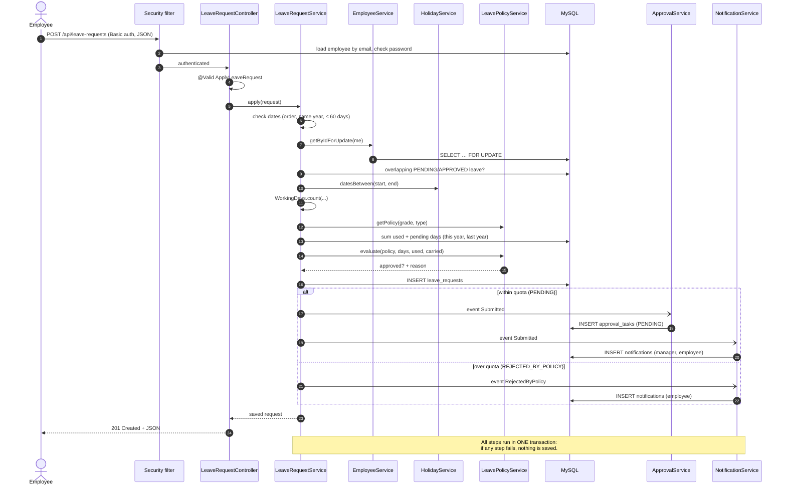

### 7.2 Manager decides

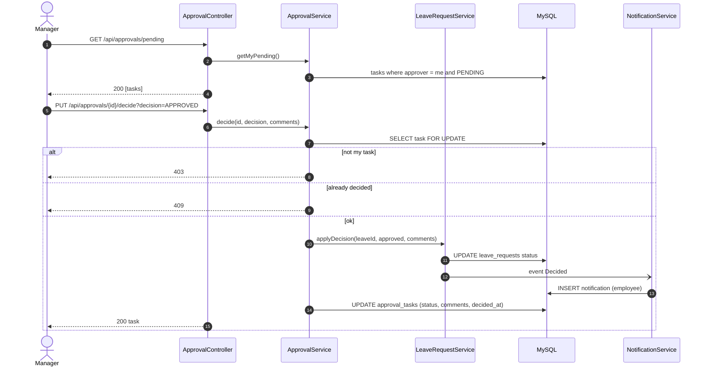

### 7.3 Cancel leave

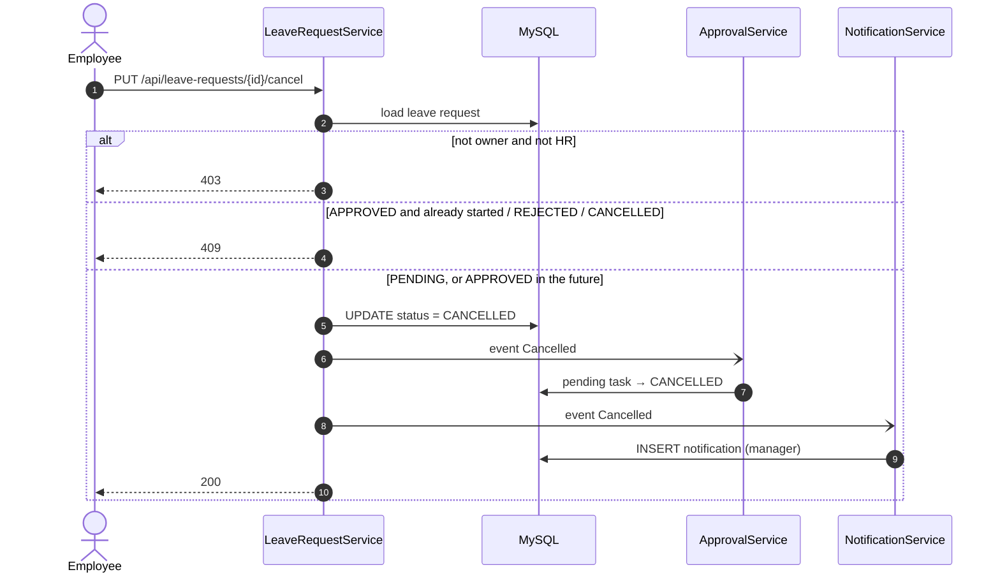

---

## 8. ER diagram and data dictionary

### 8.1 ER diagram

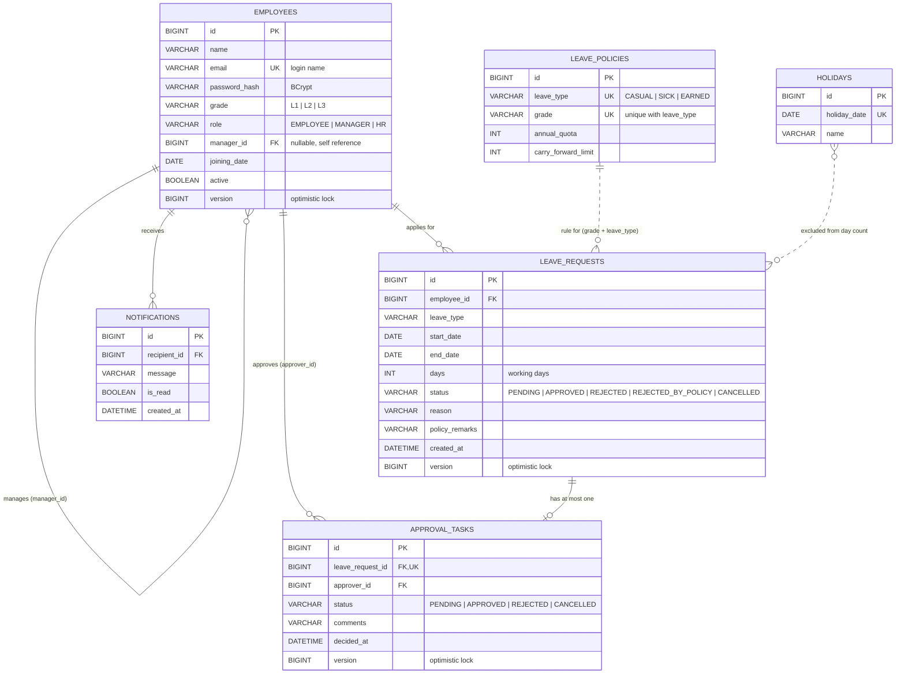

Solid lines are **foreign keys** in the database. Dotted lines are **logical links** handled in code: a policy is found by the employee's `grade` plus the request's `leave_type`, and holidays are matched by date.

### 8.2 Relationships

| From | To | Cardinality | Implemented by |
|---|---|---|---|
| employees (manager) | employees (report) | 1 : 0..N | `employees.manager_id` → `employees.id` |
| employees | leave_requests | 1 : 0..N | `leave_requests.employee_id` |
| leave_requests | approval_tasks | 1 : 0..1 | `approval_tasks.leave_request_id` (unique); only `PENDING` requests get a task |
| employees (approver) | approval_tasks | 1 : 0..N | `approval_tasks.approver_id` |
| employees | notifications | 1 : 0..N | `notifications.recipient_id` |
| leave_policies | leave_requests | 1 : 0..N (logical) | `(employees.grade, leave_requests.leave_type)` = `(grade, leave_type)` |
| holidays | leave_requests | N : N (logical) | holiday date between `start_date` and `end_date` |

### 8.3 Data dictionary

**employees**

| Column | Type | Null | Rules |
|---|---|---|---|
| id | BIGINT | no | PK, auto increment |
| name | VARCHAR(100) | no | required |
| email | VARCHAR(150) | no | unique, valid email, stored lower-case, used to log in |
| password_hash | VARCHAR(100) | no | BCrypt hash; the plain password is 8–72 characters |
| grade | VARCHAR(5) | no | `L1`, `L2`, `L3` |
| role | VARCHAR(20) | no | `EMPLOYEE`, `MANAGER`, `HR` |
| manager_id | BIGINT | yes | FK to employees; the manager must be active and a MANAGER or HR; no loops |
| joining_date | DATE | no | defaults to the creation date; used for carry-forward |
| active | BOOLEAN | no | `false` = deactivated (cannot log in) |
| version | BIGINT | no | optimistic locking |

**leave_policies**

| Column | Type | Null | Rules |
|---|---|---|---|
| id | BIGINT | no | PK |
| leave_type | VARCHAR(20) | no | `CASUAL`, `SICK`, `EARNED` |
| grade | VARCHAR(5) | no | unique together with leave_type |
| annual_quota | INT | no | 0–365 working days per year |
| carry_forward_limit | INT | no | 0–365; maximum unused days moved to the next year |

Seed data (`V2__seed_leave_policies.sql`):

| Grade | CASUAL (quota/carry) | SICK | EARNED |
|---|---|---|---|
| L1 | 10 / 3 | 8 / 0 | 15 / 5 |
| L2 | 12 / 4 | 10 / 0 | 18 / 6 |
| L3 | 15 / 5 | 12 / 0 | 21 / 8 |

**holidays**

| Column | Type | Null | Rules |
|---|---|---|---|
| id | BIGINT | no | PK |
| holiday_date | DATE | no | unique |
| name | VARCHAR(100) | no | required |

**leave_requests**

| Column | Type | Null | Rules |
|---|---|---|---|
| id | BIGINT | no | PK |
| employee_id | BIGINT | no | FK; always the logged-in user |
| leave_type | VARCHAR(20) | no | `CASUAL`, `SICK`, `EARNED` |
| start_date / end_date | DATE | no | end ≥ start, same year, at most 60 calendar days |
| days | INT | no | working days (weekends and holidays excluded), at least 1 |
| status | VARCHAR(20) | no | see state diagram 6.1 |
| reason | VARCHAR(255) | yes | employee's reason |
| policy_remarks | VARCHAR(255) | yes | result of the policy check |
| created_at | DATETIME | no | set on insert |
| version | BIGINT | no | optimistic locking |

**approval_tasks**

| Column | Type | Null | Rules |
|---|---|---|---|
| id | BIGINT | no | PK |
| leave_request_id | BIGINT | no | FK, unique |
| approver_id | BIGINT | no | FK; the employee's manager when the request was made |
| status | VARCHAR(20) | no | see state diagram 6.2 |
| comments | VARCHAR(255) | yes | approver's comments |
| decided_at | DATETIME | yes | set when decided or cancelled |
| version | BIGINT | no | optimistic locking |

**notifications**

| Column | Type | Null | Rules |
|---|---|---|---|
| id | BIGINT | no | PK |
| recipient_id | BIGINT | no | FK to employees |
| message | VARCHAR(500) | no | truncated to 500 characters |
| is_read | BOOLEAN | no | default `false` |
| created_at | DATETIME | no | set on insert |

**flyway_schema_history** is managed by Flyway and lists the migrations that have been applied. Do not edit it.

### 8.4 Indexes

| Index | Table | Columns | Used by |
|---|---|---|---|
| uk_employees_email | employees | email | login, duplicate check |
| uk_leave_policies_grade_type | leave_policies | grade, leave_type | policy lookup |
| uk_holidays_date | holidays | holiday_date | duplicate check, date range |
| idx_leave_requests_employee_start | leave_requests | employee_id, start_date | own requests, balance, overlap |
| uk_approval_tasks_leave_request | approval_tasks | leave_request_id | one task per request |
| idx_approval_tasks_approver_status | approval_tasks | approver_id, status | pending list |
| idx_notifications_recipient | notifications | recipient_id, is_read | notification list |

---

## 9. Viewing and exporting the diagrams

### 9.1 View inside VS Code
1. Install the extension **Markdown Preview Mermaid Support** (`bierner.markdown-mermaid`).
2. Open this file and press `Ctrl+Shift+V`. All Mermaid diagrams render.
3. For the UML use-case file, install **PlantUML** (`jebbs.plantuml`), open `diagrams/use-case.puml`, and press `Alt+D`. This needs Java, which is already installed, and uses the online renderer by default.

### 9.2 View online (no install)
- **Mermaid:** copy a ```` ```mermaid ```` block into https://mermaid.live. It shows a live preview, and **Actions → PNG/SVG** downloads an image.
- **PlantUML:** paste `diagrams/use-case.puml` into https://www.plantuml.com/plantuml.
- **ER diagram as a database model:** in MySQL Workbench, open **Database → Reverse Engineer…**, choose the `leave_management_db` connection and schema, and click through. Workbench draws the ER diagram from the real tables; **File → Export → PNG** saves it.

### 9.3 Export all diagrams to images from the command line
Rendered images are already in [`diagrams/`](diagrams/). To regenerate them after a change (needs Node.js):
```powershell
cd D:\Java-learn\leave-management\docs
npx -y @mermaid-js/mermaid-cli -i DESIGN.md -o diagrams\design.md -e png
```
This writes one PNG per Mermaid block (`diagrams/design-1.png`, `design-2.png`, …) plus a copy of this document that uses the images.

### 9.4 Keeping the documentation up to date
- A new table or column needs a new Flyway migration, plus an update to the ER diagram and data dictionary (section 8).
- A new endpoint or rule needs a new or updated user story (section 2), a use case (sections 3–4), and a flow if the behaviour changes (sections 5–7).
- Re-run the export in 9.3 and commit the changed images together with the code.
