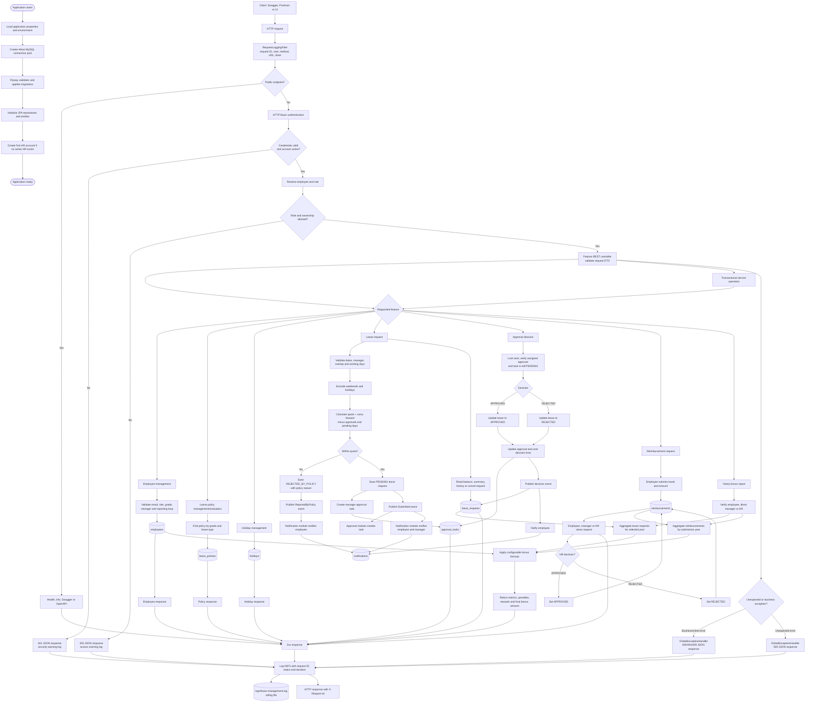

# Complete System Flow

This flowchart shows the main runtime paths in the Leave Management application, including startup, authentication, leave, approvals, reimbursements, bonus calculation, notifications, persistence, logging, and errors.

## Main API paths

| Flow | Primary endpoints |
|---|---|
| Health and documentation | `/actuator/health`, `/actuator/info`, `/swagger-ui.html`, `/v3/api-docs` |
| Employees | `/api/employees` |
| Policies and holidays | `/api/policies`, `/api/holidays` |
| Leave lifecycle | `/api/leave-requests`, `/api/approvals` |
| Notifications | `/api/notifications` |
| Reimbursements | `/api/reimbursements` |
| Bonus calculation | `/api/bonuses/{employeeId}?year=YYYY` |

## Business outcomes

- Valid leave within quota becomes `PENDING` and creates a manager approval task.
- Leave outside quota becomes `REJECTED_BY_POLICY`.
- The assigned manager changes pending leave to `APPROVED` or `REJECTED`.
- HR changes pending reimbursements to `APPROVED` or `REJECTED`.
- The bonus report combines yearly leave status metrics and reimbursement status/amount metrics.
- Every request receives an `X-Request-Id`; successful requests, warnings, errors, status codes and timings are written to the rolling log file.
